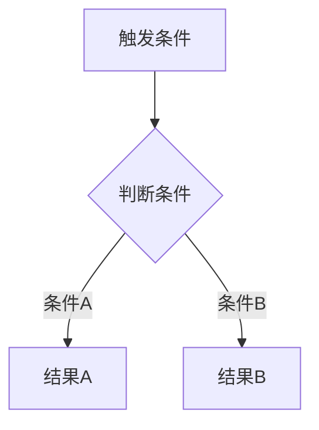
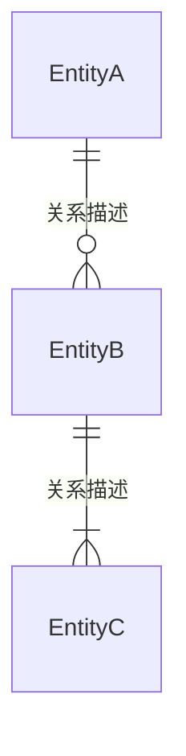
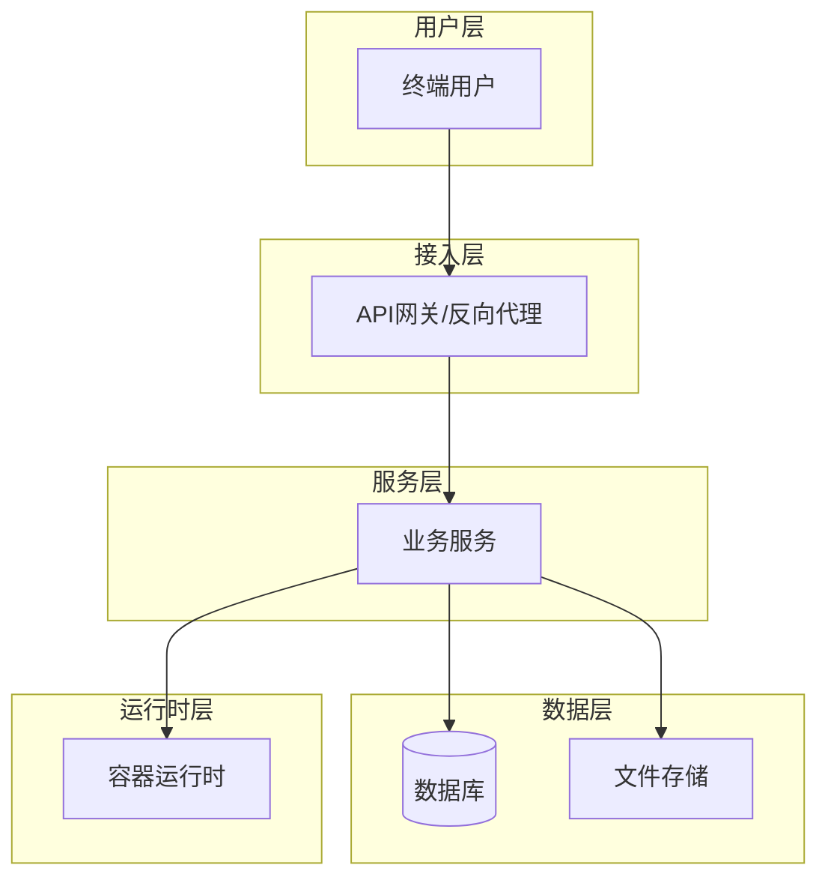

# 面向Agent的产品开发基准文档模板（Product Agent Baseline Doc, PABD）

> **文档类型**：产品基准文档（PABD）模板  
> **下游产物**：产品需求文档 / 用户故事卡 / 交互设计卡 / 研发接口文档 / 数据库设计 / 测试用例 / GTM计划 / 产品手册等  
> **使用场景**：产品经理启动规划新产品/新版本时，按此模板收集和结构化上下文信息  
> **下游读者**：研发Agent、UI Agent、测试Agent、市场Agent、文档Agent——所有下游Agent零上下文启动  
> **设计原则**：文档自闭环，下游Agent不依赖外部输入即可独立产出交付物  
> **触发词**：产品基准文档 / PABD文档 / PABD

---

## 为何需要PABD

一份标准的产品需求文档（PRD）写完后，往往只能指导开发。但产品开发是一个多角色协作的过程：

- 切图仔需要从中提取交互设计故事卡
- 程序猿需要从中导出API设计和数据库设计
- UI设计师需要理解品牌调性和视觉约束
- 测试工程师需要编写测试用例和测试方案
- 市场团队需要提炼产品卖点和GTM策略
- 文档团队需要编写用户手册和产品介绍

**PABD的目标**：一份文档，覆盖以上所有角色的信息需求。每个角色按需阅读相关章节，不需要额外上下文即可开工。

---

## 模板使用指南

### 写给用户的话

- **上下文决定质量**：用户提供的信息越多、越具体，下游Agent的产出越精准。不要刻意隐藏你对技术、设计、硬件的理解和偏好。
- **边界比细节重要**：写清楚"做什么"和"不做什么"，比写一堆细节更有价值
- **枚举值全部写出来**：不要写"等"字，Agent猜不到你省略了什么
- **假设要显式声明**：你默认知道，但读者不知道的前提条件，尽量全部写出来

### 写给Agent的话

**你是信息收集器，不是过滤器。**

用户无意间透露的**技术选型倾向**（"我们团队用Go"）、**UI设计偏好**（"我喜欢上下布局"）、**硬件选型**（"客户给的服务器GPU是A100"）——这些不是噪音，是上下文。不要擅自模糊化或删除。

**你的职责是**：

| 做法         | 示例                                              |
| ---------- | ----------------------------------------------- |
| ✅ **原样记录** | PM说"用Nginx做反向代理"→ 写"用Nginx做反向代理，以便于XXX"         |
| ✅ **主动确认** | "你说的Nginx是团队标准还是只是举例？我写进文档时标注为偏好，还是硬性要求？"       |
| ✅ **标注来源** | 用 `[PM偏好]` / `[团队惯例]` / `[客户环境]` 等标签区分信息来源和软硬程度 |
| ❌ **擅自过滤** | PM说"Nginx"→ 你写"反向代理层"。你破坏了原始信息                  |

**核心规则**：收集一切上下文，标注来源和置信度，让下游Agent自己判断。基准文档的"基准"二字，意思就是**信息全、不加工、可追溯**。


**字段用表格，流程用Mermaid**：结构化的信息比散文更易被Agent消费

---

## PABD 模板正文

> **使用说明**：以下章节按顺序填写。每个 `[待填写]` 是必填项，`[选填]` 可按需删除。灰色引用块是填写提示，填写完后删除。

### 文档元数据

```
产品名称：[待填写]
版本号：[待填写 - 如 v0.1]
创建日期：[待填写 - YYYY-MM-DD]
更新日期：[待填写]
文档状态：[起草中 / 评审中 / 已定稿]

```

### 1. 产品概述

> **填写提示**：用2-3段话讲清楚——这是什么产品？解决谁的什么问题？为什么现在做？商业/战略目标是什么？交付时间有无硬约束？

#### 1.1 一句话定位

[待填写 - 用一句话定义这个产品，格式："一个面向[目标用户]的[产品类型]，帮助他们[核心价值]"]

#### 1.2 产品背景

[待填写 - 为什么启动这个产品/版本？]

#### 1.3 核心价值主张

- 对用户A：[待填写]
- 对用户B：[待填写]
- （按需增减）

#### 1.4 非目标（明确不做的事）

> **填写提示**：列出V1/NOW明确不做但容易被假设为"当然要做"的事。这比写"做什么"更能防下游Agent过度设计。

- [待填写 - 如：不做在线支付、不做多语言、不做移动端适配]


### 2. 用户体系

#### 2.1 角色定义

> **填写提示**：角色不是"管理员/普通用户"这种技术标签，而是真实的使用者画像。每个角色写清楚：身份、准入方式、典型场景、以及这个角色的核心目标。

| 角色     | 身份定位  | 准入方式                           | 典型用户画像 | 核心目标  |
| ------ | ----- | ------------------------------ | ------ | ----- |
| [角色名A] | [待填写] | [如：无需注册 / 自行注册 / 管理员创建 / 系统预设] | [待填写]  | [待填写] |
| [角色名B] | [待填写] | [待填写]                          | [待填写]  | [待填写] |

#### 2.2 角色权限矩阵

> **填写提示**：✓=有权限，✗=无权限，—=不适用。不要只写模块级——把具体操作也列出来。

| 功能模块  | 具体操作    | 角色A | 角色B | 角色C |
| ----- | ------- |:---:|:---:|:---:|
| [模块1] | [操作1.1] | ✅/❌ | ✅/❌ | ✅/❌ |
|       | [操作1.2] | ✅/❌ | ✅/❌ | ✅/❌ |
| [模块2] | [操作2.1] | ✅/❌ | ✅/❌ | ✅/❌ |

**补充规则**：

- [待填写 - 如：角色X只能看到自己创建的资源，角色Y可看到全部]
- [待填写 - 如：未登录用户触发需要权限的操作时，统一提示"请先登录"]

---

### 3. 功能规格

> **核心原则**：以**业务规则、数据约束和流程逻辑**为主体。

#### 3.1 [功能模块A]

##### 3.1.1 功能目标

[待填写 - 这个功能要实现什么用户价值？]

##### 3.1.2 业务流程



> **填写提示**：Mermaid flowchart 用于描述流程分支、状态转换、决策逻辑。

##### 3.1.3 数据规则

| 规则编号     | 规则描述  | 触发条件  | 预期行为  |
| -------- | ----- | ----- | ----- |
| [模块A]-01 | [待填写] | [待填写] | [待填写] |

##### 3.1.4 输入/输出（如涉及接口）

| 方向  | 字段    | 类型   | 必填  | 约束     |
| --- | ----- |:----:|:---:| ------ |
| 输入  | [字段名] | [类型] | 是/否 | [约束描述] |
| 输出  | [字段名] | [类型] | —   | [含义描述] |

##### 3.1.5 异常处理

| 异常场景           | 处理方式                |
| -------------- | ------------------- |
| [待填写 - 如：资源不足] | [待填写 - 如：提示用户并给出原因] |

> **填写提示**：按需复制3.1模板创建更多功能模块：3.2、3.3...

---

### 4. 数据模型

> **填写提示**：这是PABD最有价值的章节之一——研发和测试工程师会重点读这里。每个实体定义清楚字段名、类型（用研发习惯的类型如 uint/string/bool/int64）、含义和约束。不要用SQL类型（varchar/bigint），用语言无关的类型。

#### 4.1 实体关系图



#### 4.2 实体定义

**实体名：[实体A]**

| 字段名   | 类型                               | 必须  | 描述        |
| ----- |:--------------------------------:|:---:| --------- |
| [字段1] | [uint/string/bool/int64/float64] | 是   | [描述，含枚举值] |
| [字段2] | [类型]                             | 否   | [描述]      |

> **填写提示**：枚举值在"描述"列用反引号标注，如 `enabled` / `disabled`。FK关系用"关联[表名]ID"描述。

**实体名：[实体B]**

（复制上述格式）

---

### 5. 部署架构

> **填写提示**：架构图尽量用概念层描述（"反向代理"而非"Nginx"），但PM已知的技术组件、硬件型号可直接采用。例如 `[PM偏好: Nginx]`、`[客户环境: A100]`。



> **填写提示**：如果V1是单服务器、V2会扩展，用实线框表示当前部署、虚线框表示未来扩展——这在Mermaid中是支持的。

---

### 6. 非功能需求

> **填写提示**：以目标值为核心（如"页面首屏加载<3秒"）。PM如提到实现思路（如"想用CDN加速"），也一并记录但标注为 `[PM思路]`，让研发参考而非必选。

| 类别   | 指标        | 目标值      | 说明           |
| ---- | --------- | -------- | ------------ |
| 性能   | [如：首屏加载]  | [<3秒]    | [待填写]        |
|      | [如：API响应] | [<500ms] | [待填写]        |
| 安全   | [如：登录防护]  | [待填写]    | [待填写]        |
|      | [如：数据加密]  | [待填写]    | [待填写]        |
| 可用性  | [如：SLA]   | [待填写]    | [待填写]        |
| 可扩展性 | [如：预留扩展点] | [待填写]    | [V2+规划，V1预留] |

---

### 7. 验收标准

#### 7.1 功能验收清单

| 编号    | 功能名称  | 验收标准       | 数据来源  |
| ----- | ----- | ---------- | ----- |
| AC-01 | [功能A] | [可通过的验收条件] | [待填写] |
| AC-02 | [功能B] | [可通过的验收条件] | [待填写] |

#### 7.2 端到端验证流程

> **填写提示**：描述一个能从登录到核心操作走通的验收路径。政府类项目验收时通常只走一遍核心流程。

```
1. [角色] → [操作A] → 预期看到[结果A]
2. [角色] → [操作B] → 预期看到[结果B]
...
N. 完成验收
```

#### 7.3 非功能验收项

| 编号    | 指标     | 验收方法  | 通过标准  |
| ----- | ------ | ----- | ----- |
| NF-01 | [性能指标] | [待填写] | [待填写] |

---

### 8. 术语表

| 术语    | 说明                                  |
| ----- | ----------------------------------- |
| [术语1] | [定义 - 特别注意行业术语或产品自定义的术语，下游Agent不知道] |
| [术语2] | [定义]                                |

---

### 9. 附录（按需）

#### 9.1 外部依赖

| 依赖项   | 说明    | 提供方   | 接口形式  |
| ----- | ----- | ----- | ----- |
| [待填写] | [待填写] | [待填写] | [待填写] |

#### 9.2 参考文档

| 文档名   | 链接/路径 | 说明    |
| ----- | ----- | ----- |
| [待填写] | [待填写] | [待填写] |
